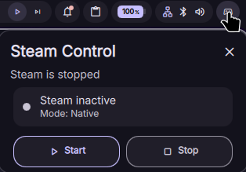

# Steam Big Picture Toggle

Un plugin de tipo widget para DankMaterialShell que permite ejecutar Steam en modo Big Picture con argumentos personalizados, comandos de inicio y enrutamiento automático de audio.



## Acerca de

Steam Big Picture Toggle proporciona un interruptor simple en tu barra de herramientas o panel de control para cambiar Steam al modo Big Picture. Permite ejecutar Steam de forma nativa o mediante Flatpak, opcionalmente dentro de Gamescope con argumentos de ventana personalizados.

Este plugin se integra con las funciones del shell: puedes especificar comandos personalizados de inicio y cierre (como cambiar perfiles de monitor a través de `dms ipc`) y enrutar automáticamente el audio a dispositivos específicos (como una TV por HDMI) configurando el volumen deseado.

## Instalación

### Gestor de plugins

El plugin se puede instalar directamente desde el explorador de plugins de DankMaterialShell.

### Instalación manual

1. Descarga o clona este repositorio.
2. Extrae o crea un enlace simbólico en el directorio de plugins de DankMaterialShell:

```bash
ln -sf /ruta/a/DankConsoleModeWithSteam "${XDG_CONFIG_HOME:-$HOME/.config}/DankMaterialShell/plugins/SteamToggle"
```

3. Abre los Ajustes de DankMaterialShell → Plugins, haz clic en "Scan for Plugins" y activa **Steam Big Picture**.
4. Añade el widget a la lista de widgets de tu DankBar.

## Comandos IPC

Controla el comportamiento del plugin a través de la IPC de DMS:

| Comando | Descripción |
| --- | --- |
| `dms ipc call plugins reload DankConsoleSteam` | Recarga el plugin en tiempo de ejecución |

## Personalización

Configura los siguientes parámetros en los Ajustes de DMS dentro de **Steam Big Picture Settings**:
- **Usar Flatpak**: Ejecuta Steam usando Flatpak (`com.valvesoftware.Steam`) o nativo.
- **Usar Gamescope**: Ejecuta Steam dentro de Gamescope.
- **Argumentos de Gamescope**: Parámetros para la ventana de Gamescope (ej. `-W 1920 -H 1080 -f -e`).
- **Comando al Cerrar**: Comando a ejecutar cuando Big Picture termine (ej. `steam` para reabrir la interfaz clásica).
- **Comando Extra al Iniciar / Cerrar**: Acciones adicionales ejecutadas antes de iniciar o tras cerrar Steam (ej. `dms ipc outputs setProfile BigPicture`).
- **Dispositivo de Audio Objetivo / Volumen / Intentos**: Nombre del dispositivo de audio destino, volumen y reintentos de búsqueda para cambiar el audio automáticamente al iniciar.
